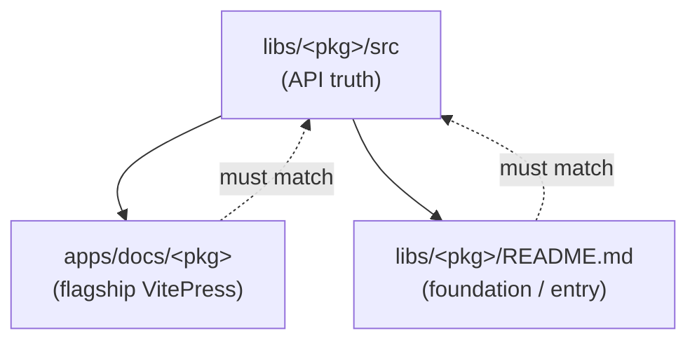

# docs

neodx has three documentation surfaces. Knowing which one owns a claim prevents drift.

## Source of truth hierarchy

**Source wins.** When docs and source disagree, the source is correct and the docs are a bug to fix
in the same change that changed the API.

## Which surface

| Surface                                           | Location                                      | Owns                                    |
| ------------------------------------------------- | --------------------------------------------- | --------------------------------------- |
| API reference, getting started, use cases, guides | `apps/docs/<pkg>` (VitePress)                 | Flagships: `svg`, `figma`, `log`, `vfs` |
| Short entry / maturity / pointer to VitePress     | `libs/<pkg>/README.md`                        | Every package; primary for foundations  |
| Current Public API shape                          | `libs/<pkg>/src/index.ts` (+ subpath barrels) | All packages — the only truth           |
| Examples (usage truth)                            | `apps/examples/<pkg>/**`                      | Flagships with runnable demos           |

## When you change docs

- **Changing the API → update docs in the same change.** A green build with stale docs is not done.
- **Changing only docs → do not imply the API changed.** No false "new in X" callouts.
- Examples must build. If you cite an example path, confirm it exists.
- Foundation docs stay minimal: a README plus the source is often enough. Do not over-document
  internals that are not Public API.

## VitePress specifics

- Docs deploy to `neodx.pages.dev` (Cloudflare Pages). A broken doc build is a real failure, not a
  warning.
- Keep inter-package links to the VitePress paths (`/svg`, `/figma`, …), matching the maturity table
  in the root `README.md`.
