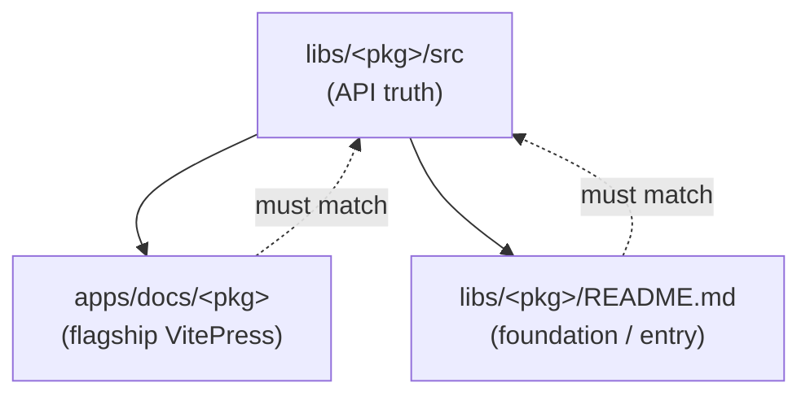

# docs

neodx has three documentation surfaces. Knowing which one owns a claim prevents drift.

## Source of truth hierarchy

**Source wins.** When docs and source disagree, the source is correct and the docs are a bug to fix
in the same change that changed the API.

## Which surface

| Surface                                           | Location                             | Owns                                    |
| ------------------------------------------------- | ------------------------------------ | --------------------------------------- |
| API reference, getting started, use cases, guides | `apps/docs/<pkg>` (VitePress)        | Flagships: `svg`, `figma`, `log`, `vfs` |
| Short entry / maturity / pointer to VitePress     | `libs/<pkg>/README.md`               | Every package; primary for foundations  |
| Current Public API shape                          | `libs/<pkg>/src` (+ subpath barrels) | All packages — the only API truth       |
| Examples (usage truth)                            | `apps/examples/<pkg>/**`             | Flagships with runnable demos           |
| Contributor / agent commands                      | `AGENTS.md`, `CONTRIBUTING.md`       | Honest `vp *` vocabulary                |

## When you change docs

- **Changing the API → update docs in the same change.**
- **Changing only docs → do not imply the API changed.**
- Examples must build (`vp -C apps/examples/... build` or the package script).
- Foundation docs stay minimal: README + source is often enough.
- Prefer Markdown links to canonical paths; keep VitePress inter-package links (`/svg`, `/figma`, …)
  aligned with the root `README.md` maturity table.

## VitePress

- Docs deploy to `neodx.pages.dev` (Cloudflare Pages). A broken doc build is a real failure.
- Product notes about future vfs plugin adapters (oxlint/oxfmt/…) belong in docs or reports — they
  are not must-ship work unless authorized.
