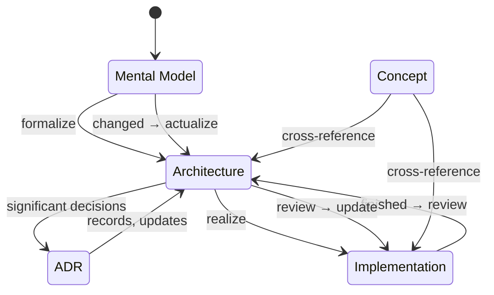

# Architecture

Formalized implementation contract for the [Mental Model](./mental-model.md).

Provides no implementation details. Extends the [Mental Model](./mental-model.md) with implementation constraints, boundaries, guidelines, and expected logic and data flows. Business-oriented parts formalize [Business Logic](./business-logic.md) expectations without code. Aggregates related [ADRs](#adr) and notable [Implementation](./implementation.md) artifacts. Source of **expectations** for what the system should do and how parts relate; not source of actual behavior ([Implementation](./implementation.md)). The [Public API](./public-api.md) is the user-land surface that promises these expectations to callers.

This page defines the **Architecture artifact**, a foundational concept used across skills, docs, and deliverables.
The `adjacent skill (not ported)` skill applies this meaning when reasoning about how the neodx
stack fits together, specifications, client and server boundaries, and cross-layer flow.

## Artifact flow

The diagram describes revision paths between artifacts rather than a one-shot pipeline.

Reading the diagram:

- **Forward chain:** [Mental Model](./mental-model.md) formalizes into [Architecture](./architecture.md); [Architecture](./architecture.md) realizes into [Implementation](./implementation.md).
- **ADR loop:** significant decisions become [ADRs](#adr); accepted [ADRs](#adr) record and update the contract on [Architecture](./architecture.md).
- **Revision directions:**
  - A changed [Mental Model](./mental-model.md) moves forward: actualize [Architecture](./architecture.md), then review and update [Implementation](./implementation.md).
  - Finished [Implementation](./implementation.md) feeds back.
    Review behavior against the contract, then finalize [Architecture](./architecture.md) and affected [Concepts](./concept.md).
- **Cross-reference:** [Concept](./concept.md) ties business meaning to contract and behavior; it does not replace either.

Stabilizes through a [Loop](./loop.md): formalize contract; absorb decisions as [ADRs](#adr) until the representation matches shared [Intention](./intention.md).

## ADR

An Architecture Decision Record captures a single architecturally significant decision: context, rationale, trade-offs, and consequences.

A decision is architecturally significant when it measurably affects [Architecture](./architecture.md) or its qualities; only those decisions earn an [ADR](#adr). The collected [ADRs](#adr) form the decision log: the durable record of why [Architecture](./architecture.md) took its current shape.

neodx treats each [ADR](#adr) as immutable once accepted.
Revisiting a decision adds a new ADR that supersedes the old one, so history is preserved instead of overwritten.
External vocabulary and the distinction between common practice and neodx policy are recorded in [maintenance](./MAINTENANCE.md#source-ledger).

Types, by the invariant a decision asserts:

- **Constraint / requirement** (positive invariant): what the system must do or use; required stack, mandated [Concept](./concept.md) interaction, security policy
- **Restriction / boundary** (negative invariant): what the system must not do; forbidden interaction, prohibited dependency, explicit scope limit
- **Proposal / guideline** (non-binding): convention worth remembering that is not part of the [Architecture](./architecture.md) contract itself

Every [ADR](#adr) carries its justification: rationale, trade-offs, and accepted consequences.
