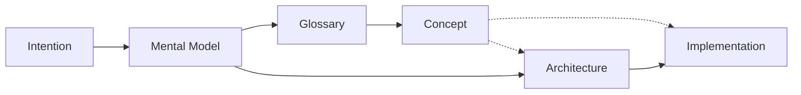

# Concept

Final representation of an encapsulated business concept.

Each [Concept](./concept.md) encapsulates one idea within [Business Logic](./business-logic.md). It describes its [Mental Model](./mental-model.md), local and external [Glossary](./mental-model.md#glossary) references, [Architecture](./architecture.md), and notable [Implementation](./implementation.md). Cross-references [Architecture](./architecture.md) and [Implementation](./implementation.md); it does not replace either.

## Conceptualization

[Conceptualization](./development.md#conceptualization) is the phase where [Intention](./intention.md) becomes structured understanding:

- [Mental Model](./mental-model.md) holds the whole
- [Glossary](./mental-model.md#glossary) distills terms
- **[Concept](./concept.md)** encapsulates one [Business Logic](./business-logic.md) idea with stable identity

[Conceptualization](./development.md#conceptualization) completes before [Architecture](./architecture.md) formalizes the contract.

## Scope: local vs dedicated

| Scope         | Character                                                                               | Typical use                                                                      |
| ------------- | --------------------------------------------------------------------------------------- | -------------------------------------------------------------------------------- |
| **Local**     | Sub-concept; highly dependent on parent context; not essential as a standalone identity | Detail embedded in a larger [Mental Model](./mental-model.md); referenced inline |
| **Dedicated** | Essential, independent, valuable enough to own a stable definition and cross-links      | Shared across constructs; referenced from multiple artifacts                     |

Prefer local when a name would not mean anything outside its parent. Promote to dedicated when the idea recurs, constrains [Architecture](./architecture.md), or must cross-reference [Implementation](./implementation.md) independently.

## Relations

[Concept](./concept.md) sits between terminology and contract: it names what [Architecture](./architecture.md) and [Implementation](./implementation.md) must honor for that business idea. The [Public API](./public-api.md) is the caller-facing surface through which a Concept is experienced.
