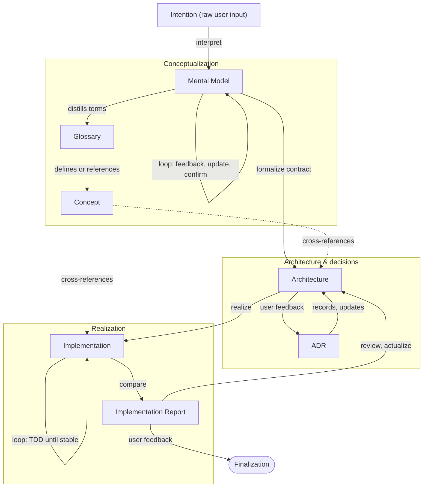
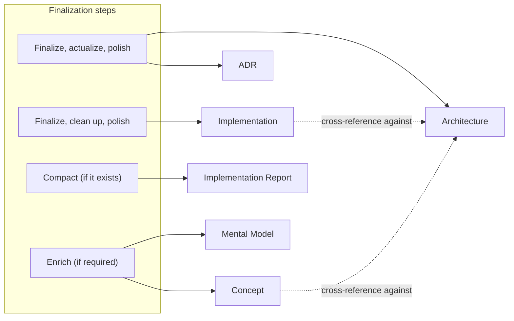
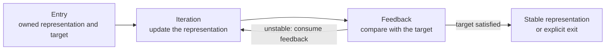

# Development Process

Foundational meta-workflow for every construct: project, library, tool, workflow, or source artifact.

This page defines why coordinated development movement exists and how its concepts and artifacts relate.
It is not a practical flow.
`adjacent skill (not ported)` operationalizes discovery, planning, [Realization](#realization), polish, handoff, and pipeline delegation while inheriting this meta-workflow as its foundation.

Every construct begins with [Intention](./intention.md) and moves toward a finalized, cross-referenced result.
The diagrams show that common movement, the [Loop](./loop.md) instances that stabilize its representations, and how [Finalization](#finalization) closes the work.

[Finalization](#finalization) expands into four actions and the artifacts each touches:

## Spine

[Intention](./intention.md) → [Mental Model](./mental-model.md) → [Architecture](./architecture.md) → [Implementation](./implementation.md) → [Implementation Report](./implementation.md#implementation-report) → [Finalization](#finalization).

## Conceptualization

Phase where [Intention](./intention.md) becomes structured understanding: [Business Logic](./business-logic.md) represented in the [Mental Model](./mental-model.md), [Glossary](./mental-model.md#glossary), and [Concept](./concept.md). Completes before [Architecture](./architecture.md) formalizes the contract.

## Realization

Phase where [Architecture](./architecture.md) becomes [Implementation](./implementation.md) and optional [Implementation Report](./implementation.md#implementation-report). Stabilizes through [Loop](./loop.md) instances (including TDD via `adjacent skill (not ported)`).

## Feedback through [Loop](./loop.md)

Three Development Process representations stabilize through [Loop](./loop.md) instances with different artifacts and feedback sources:

The shape stays constant while the representation, target, and feedback source change:

- **[Mental Model](./mental-model.md):** user confirmation, stakeholder review, reconciliation with [clarified intention](./intention.md#clarified-intention)
- **[Architecture](./architecture.md):** user decisions, trade-off review, new [ADR](./architecture.md#adr) candidates
- **[Implementation](./implementation.md):** tests, automation, diff against [Architecture](./architecture.md) and [Business Logic](./business-logic.md), code review

Feedback may come from people, tests, tooling, or explicit comparison artifacts. Each iteration must consume feedback and move the owned artifact toward stability.

[Loop](./loop.md) owns the common meta-properties.
`adjacent skill (not ported)` and other practical owners define the steps, gates, and completion criteria of each concrete loop.

The [Glossary](./mental-model.md#glossary) and [Concept](./concept.md) sit beside [Conceptualization](#conceptualization): the [Glossary](./mental-model.md#glossary) distills terms; each [Concept](./concept.md) cross-references [Architecture](./architecture.md) and [Implementation](./implementation.md) it touches.

## Finalization

Closing movement of the Development Process, not a single artifact. It:

- Actualizes and cross-references every artifact against [Architecture](./architecture.md) and its [ADRs](./architecture.md#adr)
- Compacts the [Implementation Report](./implementation.md#implementation-report) when one exists
- Enriches [Mental Model](./mental-model.md) and [Concepts](./concept.md) when required

`adjacent skill (not ported)` and related skills operationalize [Realization](#realization) and [Finalization](#finalization); this document defines the meta-flow they inherit.
