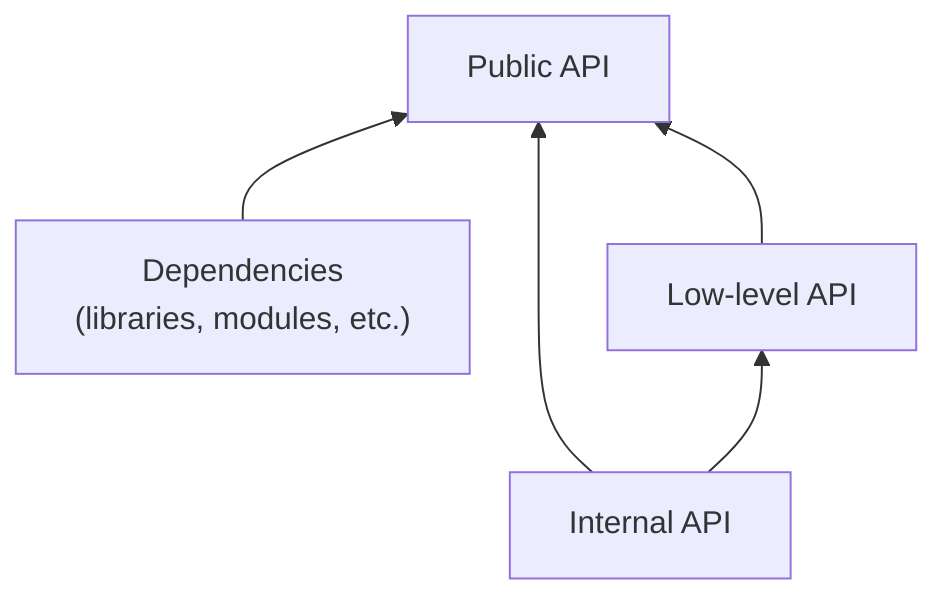
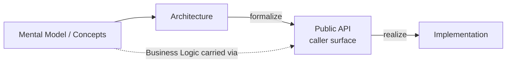

# Public API

A **Public API** is the primary set of user-land abstractions an encapsulated construct offers for normal caller tasks.
The construct may be a module, library, service, component, or reusable logic block.
Its Public API is the contract callers are expected to learn and depend on.

A Public API represents [Intention](./intention.md)'s tasks and outcomes.
It exposes shared [Mental Model](./mental-model.md) vocabulary, main [Concepts](./concept.md), and [Architecture](./architecture.md) constraints.
The surface expresses them through names, types, operations, events, configuration, and returned [scoped surfaces](/.agents/skills/principles/references/encapsulation.md).
[Implementation](./implementation.md) makes the surface real.
[Business Logic](./business-logic.md) reaches it through the Mental Model and Concepts rather than as a separate feed.
Public API becomes relevant during [Realization](./development.md#realization), but it is not a separate stage in the [Development Process](./development.md).

Public API belongs to Philosophy as a foundation concept because downstream work needs a stable mental model of the surface before it can design, test, or review one.
`adjacent skill (not ported)` owns Public API Design and Public API TDD procedures; this page names only the contract they depend on.

A symbol belongs to the Public API when it carries a stable caller concept with a clear owner.
Removing it would change how callers work or what they can rely on.
Export alone does not make a symbol public in this conceptual sense.
Every Public API declaration carries a concise intention annotation naming the normal caller task or outcome; strong
names and types make that annotation shorter rather than optional.
The Principles [elevation gate](/.agents/skills/principles/references/abstractions.md#elevation-gate) governs when a helper earns that status.
[Encapsulation](/.agents/skills/principles/references/encapsulation.md) and [semantics](/.agents/skills/principles/references/semantics.md) govern the resulting surface quality.

A Public API change propagates through its bindings because callers and other artifacts depend on the surface.
The surface changes first, and contract tests change with it.
[Implementation](./implementation.md) follows while remaining honest against [architectural expectations](./architecture.md).
Philosophy owns that relationship.
`adjacent skill (not ported)` owns design approval, Public API TDD, change, and versioning procedure.

The two supporting tiers differ by exposure intent, not reachability.

## Low-level API

A **Low-level API** is intentionally exported for advanced use such as composition, extension, plugins, integrations, or escape hatches behind the Public API.

## Internal API

An **Internal API** is reachable but not intended for caller use, including local helpers, debugging, inspection, or direct access to underlying logic.

Both remain local supporting terms here, not glossary concepts.
They follow the same local-versus-dedicated distinction as a [Concept](./concept.md#scope-local-vs-dedicated).
Keep them local until the content proves they need standalone foundational meaning.
Important low-level and Internal API declarations also carry intention annotations when callers or maintainers need
their extension role, invariant, side effect, or ownership boundary. Refactoring's
`adjacent skill (not ported)`
keeps these relationships intact during structural change.

Public API sits closest to [Concept](./concept.md) and [Architecture](./architecture.md).
It names the user-land shape through which callers experience the concept and the contract.

In [principles](/.agents/skills/principles/SKILL.md), Public API sharpens questions about abstraction quality, [encapsulation](/.agents/skills/principles/references/encapsulation.md), and [semantics](/.agents/skills/principles/references/semantics.md); it gives those heuristics a stable target when code exposes a caller-facing surface, without replacing them.
