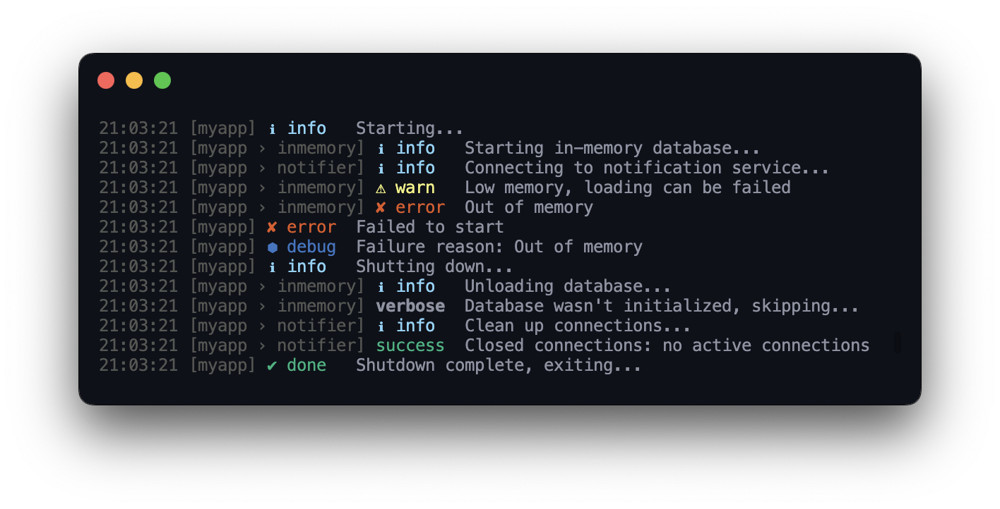

<h1 align="center">
  <a aria-label="@neodx - Frontend toolkit" href="https://github.com/secundant/neodx">
    @neodx: Everyday instruments for web development
  </a>
</h1>
<hr />

This project is designed to tackle common web development challenges with ease.

Check out our [documentation](https://neodx.pages.dev) to learn more!

> **Warning**
> Most of the packages are still under development, so API may change.
> I'll try to keep it stable, but updates still can bring breaking changes.

Packages overview:

- [@neodx/figma](#neodxfigma) | [docs](https://neodx.pages.dev/figma) | [source](./libs/figma)
- [@neodx/svg](#neodxsvg) | [docs](https://neodx.pages.dev/svg) | [source](./libs/svg)
- [@neodx/log](#neodxlog) | [docs](https://neodx.pages.dev/log) | [source](./libs/log)
- [@neodx/vfs](#neodxvfs) | [docs](https://neodx.pages.dev/vfs) | [source](./libs/vfs)

### Maturity

| Package           | npm    | Maturity | Notes                     |
| ----------------- | ------ | -------- | ------------------------- |
| `@neodx/svg`      | 0.8.0  | beta     | Flagship; docs + examples |
| `@neodx/figma`    | 0.6.0  | beta     | Flagship; docs + examples |
| `@neodx/log`      | 0.4.2  | beta     | Flagship; docs            |
| `@neodx/vfs`      | 0.3.0  | beta     | Flagship; docs            |
| `@neodx/colors`   | 0.2.9  | alpha    | Foundation                |
| `@neodx/std`      | 0.4.0  | alpha    | Foundation                |
| `@neodx/fs`       | 0.0.13 | alpha    | Foundation                |
| `@neodx/glob`     | 0.1.2  | alpha    | Foundation                |
| `@neodx/pkg-misc` | 0.0.11 | alpha    | Foundation                |

Workspace-wide 1.0 is the S7 stream (not started). Treat the table as a snapshot of published
versions, not a release promise.

### [@neodx/figma](./libs/figma)

Figma is a great tool for design collaboration, but we don't have a solid way to use it in our development workflow.

#### But we have a problem!

Probably, you've already tried to write your own integration or use some existing solutions and faced the following problems as me:

- 🤯 Multiple different not maintained packages with different APIs
- 🫠 Bad documentation/usage examples or even no documentation at all
- 💀 Terrible flexibility and solution design, you just can't use it in your project because of the different document structure or workflow
- 🙅‍♀️ No type safety, autocomplete, etc.

In other words, there is no really well-designed complex solution for Figma integration.

#### Let's solve it!

So, `@neodx/figma` is an attempt to create it. Currently, we have the following features:

- **Flexible Export CLI**: You can use it to export icons or other elements. It's a simple wrapper around our Node.JS API.
- **Typed Figma API**: All Figma API methods are typed and have autocomplete support.
- **Built-in document graph API**: Figma API is too low-level for writing any stable solution. We provide an API that allows you work with the document as a simple high-level graph of nodes.

[Visit `@neodx/figma` documentation](https://neodx.pages.dev/figma) to learn more!

See our examples for more details:

- [SVG sprite generation on steroids with Figma export](./apps/examples/svg/figma) - Integrated showcase of the `@neodx/svg` and `@neodx/figma` packages with real application usage!
- [Export icons from the Community Weather Icons Kit](./apps/examples/figma/export-file-assets) - A simple step-by-step example of how to use the `@neodx/figma` to export icons.
- [Export published Figma components](./apps/examples/figma/export-published) - Export published components from a Figma library.

Also, we have some ideas for future development, so stay tuned and feel free to request your own! 🚀

### [@neodx/svg](./libs/svg)

Supercharge your icons ⚡️

Are you converting every SVG icon to a React component with SVGR or something similar? It's so ease to use!

But wait; did you know that SVG sprites are a native approach for icons? It's even easier to use!

```typescript jsx
import { Icon, type AnyIconName } from '@/shared/ui/icon';

export interface MyComponentProps {
  icon: AnyIconName;
}

export const MyComponent = ({ icon }: MyComponentProps) => (
  <>
    {/* Use as is */}
    <Icon name="common/check" />
    {/* Change color */}
    <Icon name="common/close" className="text-red-500" />
    {/* Change size */}
    <Icon name="text/bold" className="text-lg" />
    {/* Add any other styles */}
    <Icon name="actions/delete" className="p-2 rounded-md bg-stone-300" />
    {/* Use simple type-safe names instead of weird components */}
    <Icon name={icon} />
  </>
);
```

No runtime overhead, one component for all icons, native browser support, static resource instead of JS bundle, etc.

Sounds good? Of course! Native sprites are unfairly deprived technique.
Probably, you already know about it, but didn't use it because of the lack of tooling.

Here we go! Type safety, autocomplete, runtime access to icon metadata all wrapped in simple plugins for all popular bundlers.

[Visit `@neodx/svg` documentation](https://neodx.pages.dev/svg) to learn more!

Also, you can check out our examples:

- [React, Vite, TailwindCSS, and multicolored icon](./apps/examples/svg/vite-react) - A step-by-step tutorial showcasing how to integrate sprite icons into your Vite project.
- [React, Vite, icons exported by "@neodx/figma"](./apps/examples/svg/figma) - Integrated showcase of the seamless automation capabilities of `@neodx/svg` and `@neodx/figma` for your icons!
- [Next.js, webpack and simple flat icons](./apps/examples/svg/next) - An example demonstrating the usage of `@neodx/svg` webpack plugin with Next.js.

### [@neodx/log](./libs/log)

A lightweight, flexible, and isomorphic logger and logging framework designed for modern development needs.

Tired of dealing with `console.log`?
Having trouble finding a suitable logging library because they're too heavy, platform-specific, or not flexible enough?

I faced the same issues, which led me to create `@neodx/log`.
It's simple, efficient, and avoids most critical drawbacks.
Furthermore, it's easily replaceable and extensible, making it a great fit for your development needs.

<div align="center">
  
</div>

- ~ 1KB gzipped in browser
- Configurable log levels and log targets
- Built-in JSON logs in production and pretty logs in development for Node.js

```typescript
import { createLogger } from '@neodx/log';
import { createWriteStream } from 'node:fs';

// Simple setup

const logger = createLogger({
  name: 'my-app',
  level: process.env.NODE_ENV === 'production' ? 'info' : 'debug'
});

logger.debug({ login, password }, 'User logged in, session id: %s', sessionId); // Will be ignored in production
logger.warn('Retries: %i', retriesCount); // Our default levels: error, warn, info, verbose, debug

// Nested loggers

const child = logger.child('child'); // Child logger will inherit parent logger settings

child.info('Hello, world!'); // [my-app > child] Hello, world!

// Clone and extend

const forked = child.fork({ meta: { requestId } }); // Forked logger will inherit parent logger settings and extend config

forked.info({ path, method }, 'Request received'); // [my-app > child] Request received { path: '/api', method: 'GET', requestId: '...' }

// Custom log targets

const targeted = createLogger({
  name: 'my-app',
  level: 'debug',
  target: createPrettyTarget()
});
// Or you can use array notation to define multiple targets:
const withMultipleOutput = createLogger({
  target: [
    createPrettyTarget(), // Will log all levels to console
    {
      level: 'info',
      target: createJsonTarget({
        target: createWriteStream('logs/info.log')
      })
    }
  ]
});
```

### [@neodx/vfs](./libs/vfs)

Are you working on tasks or scripts that depend on the file system, such as code generation, codemods, or internal tools? Have you ever struggled to test them, needed a "dry-run" mode, or encountered other challenges?

Meet `@neodx/vfs`, the missing abstraction layer for file system operations that makes working with the file system a breeze. Let's take a look at an example:

```typescript
import { createVfs } from '@neodx/vfs';

const fs = createVfs();

await fs.writeJson('.cache/meta.json', { timestamp: Date.now(), stats });
await fs.updateJson('package.json', pkg => {
  pkg.version = '1.0.0';
});
await fs.write('src/index.ts', 'export const foo = 42;');
await fs.apply();
```

While it may seem unnecessary at first glance, let's explore the core concepts that make `@neodx/vfs` invaluable:

- Single abstraction - just share `Vfs` instance between all parts of your tool
- Inversion of control: you can provide any implementation of `Vfs` interface
  - Btw, we already have built-in support in the `createVfs` API
- Dry-run mode: you can test your tool without any side effects (only in-memory changes, read-only FS access)
- Virtual mode: you can test your tool without any real file system access, offering in-memory emulation for isolated testing
- Attached working directory - you can use clean relative paths in your logic without any additional logic
- Extensible: you can build your own features on top of `Vfs` interface
  - Currently, we have built-in support for formatting files, updating JSON files, and package.json dependencies management

In other words, it's designed as single API for all file system operations, so you can focus on your tool logic instead of reinventing the wheel.

## Development and contribution

This monorepo uses [Yarn 4](https://yarnpkg.com/) and [Vite+](https://viteplus.dev/guide/) (`vp`).
**Node.js 22+** is required (`vp pack` needs `Promise.withResolvers`).

Everyday path:

```shell
vp install                 # or: yarn
vp check                   # fmt + lint only (not typecheck)
cd libs/<pkg> && yarn typecheck && vp test
yarn pack:libs             # vp pack all publishable libs
```

After pack, CI also runs `yarn verify-exports` and `yarn publint`. Prefer package-cwd tests;
root `vp test` can pick up Playwright noise from `apps/e2e`.

Full contributor path: [CONTRIBUTING.md](./CONTRIBUTING.md).
Repo layout, command table, and AI routing: [AGENTS.md](./AGENTS.md).
Security / advisories: [SECURITY.md](./SECURITY.md).

### Scaffolding

```shell
yarn neodx example new-example-name   # under apps/examples
yarn neodx lib new-lib-name           # under libs
```

Entry: [tools/scripts/bin.mjs](./tools/scripts/bin.mjs).

## License

Licensed under the [MIT License](./LICENSE).
