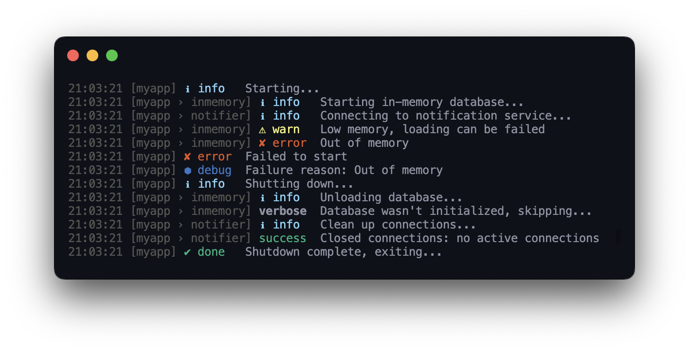

# @neodx/log

::: danger WIP
Documentation is under construction...
:::

Powerful lightweight logger for new level of experience.



- **Tiny and simple**. `< 1kb!` without extra configuration
- **Fast enough**. No extra overhead, no hidden magic
- **Customizable**. You can replace most of the parts with your own
- **Isomorphic**. Automatically works in Node.js and browsers
- **Typed**. Written in TypeScript, with full type support
- **Well featured**. JSON logs, pretty console logs, error handling, and more
- **Built-in HTTP frameworks** ⛓️`express`, `koa`, Node core `http` loggers are supported out of the box

## Installation

::: code-group

```bash [Yarn]
yard add @neodx/log
```

```bash [NPM]
npm install @neodx/log
```

```bash [PNPM]
pnpm add @neodx/log
```

:::

## Getting Started

Let's start from the simplest example:

```ts
const log = createLogger();

log.info('Hello, world!'); // [my-app] Hello, world!
log.info({ object: 'property' }, 'Template %s', 'string'); // Template string { object: 'property' }
log.debug('Some additional information...'); // nothing, because debug level is disabled

const childLog = log.child('example');
const needToGoDeeper = childLog.child('next one', {
  level: 'debug'
});

childLog.warn('Hello, world!'); // [example] Hello, world!
needToGoDeeper.debug('debug is enabled here'); // [example › next one] debug is enabled here
```

Here we created a default logger, tried to log some messages, and created a child logger with a different level.
