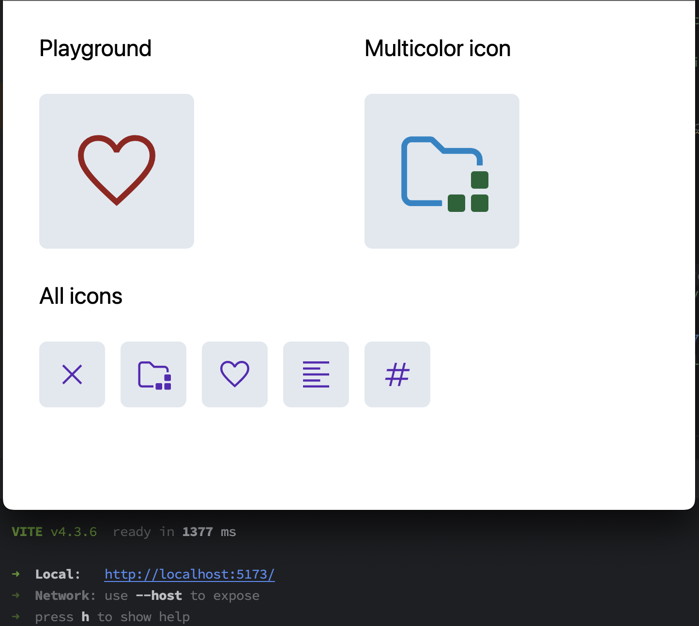

# `@neodx/svg` + Vite + React

This example shows how to use `@neodx/svg` as Vite plugin and simple step-by-step setup for React.

Based on next guides which you can find in our [documentation](https://neodx.github.io/svg):

- [Writing an `Icon` component](https://neodx.github.io/svg/writing-icon-component)
- [Setup Vite](https://neodx.github.io/svg/setup/vite)
- [Working with multicolored icons](https://neodx.github.io/svg/multicolored)

In addition, you can see how to use multicolored icons with TailwindCSS and CSS variable
(it's not very pleasant, but it works 🌝).



## Install

```bash
# npm
npm i -D @neodx/svg
# yarn
yarn add -D @neodx/svg
# pnpm
pnpm i -D @neodx/svg
```

## Add Vite plugin

```ts
// vite.config.ts
import svg from '@neodx/svg/vite';
import react from '@vitejs/plugin-react';
import { defineConfig } from 'vite';
import tsconfigPaths from 'vite-tsconfig-paths';

export default defineConfig(({ command }) => ({
  // ...
  plugins: [
    tsconfigPaths(),
    react(),
    svg({
      inputRoot: 'assets', // Root folder for SVG files, all source paths will be relative to this folder
      group: true, // Group SVG files by folder
      output: 'public/sprites', // Output folder for generated files
      fileName: '{name}.{hash:8}.svg', // Add hash to file name
      metadata: {
        path: 'src/shared/ui/icon/sprite.gen.ts', // Output file for generated TypeScript definitions
        runtime: {
          // Generate additional runtime information
          size: true,
          viewBox: true
        }
      },
      resetColors: {
        exclude: [/^flags/, /^logos/], // Exclude some icons from color reset
        replace: ['#000', '#eee', '#6C707E'], // Resets all known colors to `currentColor`
        replaceUnknown: 'var(--icon-secondary-color)' // Replaces unknown colors with custom CSS variable
      }
    })
  ]
}));
```

## Create an Icon component and describe basic styles

[shared/ui/icon/icon.tsx](./src/shared/ui/icon/icon.tsx):

```tsx
import clsx from 'clsx';
import type { SVGProps } from 'react';
import { SPRITES_META, type SpritesMap } from './sprite.gen';

// Our icon will extend an SVG element and accept all its props
export interface IconProps extends SVGProps<SVGSVGElement> {
  name: AnyIconName;
}
// Merging all possible icon names as `sprite/icon` string
export type AnyIconName = { [Key in keyof SpritesMap]: IconName<Key> }[keyof SpritesMap];
// Icon name for a specific sprite, e.g. "common/left"
export type IconName<Key extends keyof SpritesMap> = `${Key}/${SpritesMap[Key]}`;

export function Icon({ name, className, ...props }: IconProps) {
  const { viewBox, filePath, iconName, axis } = getIconMeta(name);

  return (
    <svg
      // "icon" isn't inlined because of data-axis attribute
      className={clsx('icon', className)}
      viewBox={viewBox}
      /**
       * This prop is used by the "icon" class to set the icon's scaled size
       * @see https://github.com/secundant/neodx/issues/92
       */
      data-axis={axis}
      // prevent icon from being focused when using keyboard navigation
      focusable="false"
      // hide icon from screen readers
      aria-hidden
      {...props}
    >
      {/* For example, "/sprites/common.svg#favourite". Change a base path if you don't store sprites under the "/sprites". */}
      <use href={`/sprites/${filePath}#${iconName}`} />
    </svg>
  );
}

/**
 * A function to get and process icon metadata.
 * It was moved out of the Icon component to prevent type inference issues.
 */
const getIconMeta = <Key extends keyof SpritesMap>(name: IconName<Key>) => {
  const [spriteName, iconName] = name.split('/') as [Key, SpritesMap[Key]];
  const {
    filePath,
    items: {
      [iconName]: { viewBox, width, height }
    }
  } = SPRITES_META[spriteName];
  const axis = width === height ? 'xy' : width > height ? 'x' : 'y';

  return { filePath, iconName, viewBox, axis };
};
```

[shared/ui/index.css](./src/shared/ui/index.css):

```css
@tailwind base;
@tailwind components;
@tailwind utilities;

@layer base {
  :root {
    --icon-secondary-color: currentColor;
  }
}

@layer components {
  /*
  Our base class for icons inherits the current text color and applies common styles.
  We're using a specific component class to prevent potential style conflicts and utilize the [data-axis] attribute.
  */
  .icon {
    @apply select-none fill-current inline-block text-inherit box-content;
  }

  /* Set icon size to 1em based on its aspect ratio, so we can use `font-size` to scale it */
  .icon[data-axis*='x'] {
    /* scale horizontally */
    @apply w-[1em];
  }

  .icon[data-axis*='y'] {
    /* scale vertically */
    @apply h-[1em];
  }
}
```

## Usage

### Just as a component

```tsx
export function SomeComponent() {
  return (
    <h1 className="inline-flex items-center gap-2">
      Text with icon <Icon name="common/favourite" />
    </h1>
  );
}
```

### As icons map

Let's imagine that we have a product entity with a type and a name.

When we're displaying a product, we need to show the icon corresponding to the product type.

```tsx
import { Icon, type IconName } from '@/shared/ui/icon';
import type { Product, ProductType } from '@/entities/product';

const icons = {
  clothing: 'common/clothing',
  electronics: 'common/electronics'
} satisfies Record<ProductType, IconName>;

export const ProductPreview = ({ product }: { product: Product }) => (
  <div className="flex items-center gap-2">
    <Icon name={icons[product.type]} />
    <h1 className="text-lg">{product.name}</h1>
  </div>
);
```
