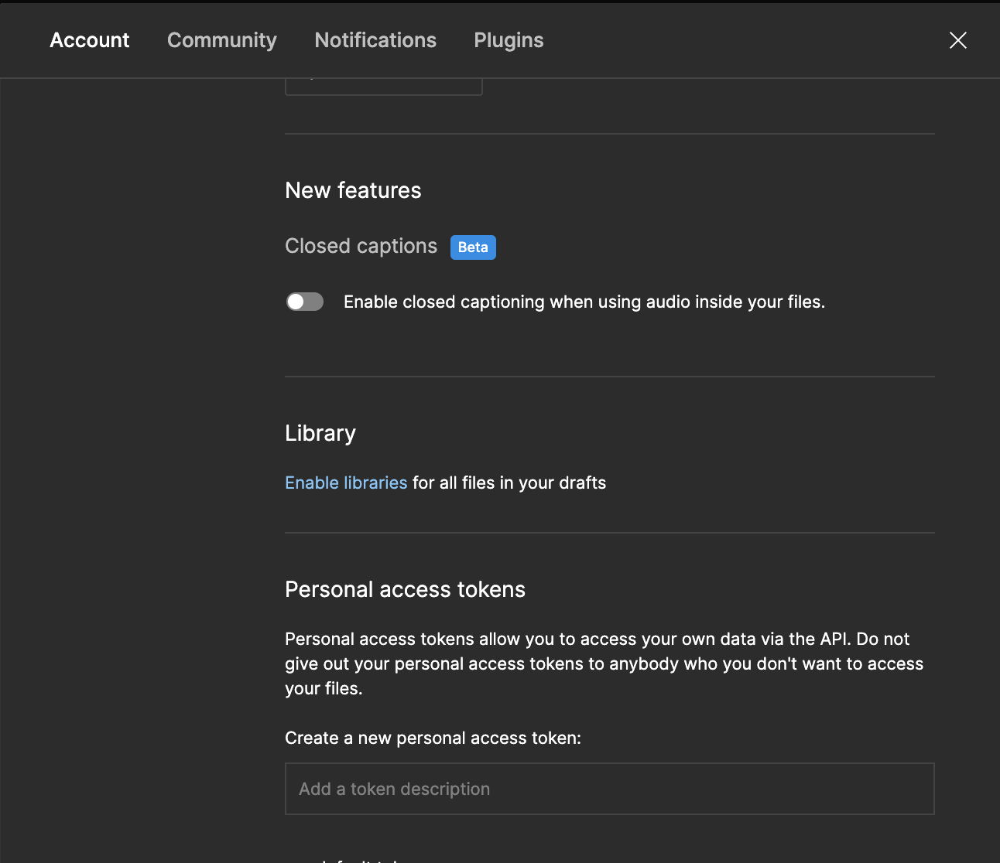

# Export icons from the Community Weather Icons Kit

A simple example of how to use the [@neodx/figma](https://www.npmjs.com/package/@neodx/figma) to export icons.

Our point of interest is a [Community Weather Icons Kit](<https://www.figma.com/file/H9kVbqMwzIxh579BpXKZbj/Weather--Icons-Kit-(Community)?type=design&node-id=0-1>).

This kit designed as a multiple component sets with different variants of the same component.

I had declared the following requirements:

- We're interested in the "icon" page
- All icons are placed under Component Sets (named group with different variants of same component)
- All Component Set contains a `Color=On` and `Color=Off` variants
- We want to export the `Color=Off` variant only

So, we need to collect all the Component Sets in the "icons" page, filter the `Color=Off` variants and name or exports based on the Component Set name.

Let's see how to do it.

## Install `@neodx/figma`

```shell
# yarn
yarn add -D @neodx/figma
# pnpm
pnpm add -D @neodx/figma
# npm
npm i -D @neodx/figma
```

## Define the configuration

```js
// figma.config.js
const { formatExportFileName } = require('@neodx/figma');

/**
 * @type {import('@neodx/figma').Configuration}
 */
module.exports = {
  export: {
    fileId: 'https://www.figma.com/file/H9kVbqMwzIxh579BpXKZbj/Weather--Icons-Kit-(Community)',
    output: 'assets/icons',
    getExportFileName({ format, node }, root) {
      const parent = root.registry.byId[node.parentId];

      return formatExportFileName(`${parent.source.name.toLowerCase()}.${format}`);
    },
    collect: {
      componentSet: /32/,
      component: 'Color=Off',
      page: 'icon'
    }
  }
};
```

## Get the token and export the icons

The token can be obtained from the [Figma account settings](https://www.figma.com/developers/api#access-tokens):



```shell
# yarn
yarn figma export --token <your_token>
# pnpm
pnpm figma export --token <your_token>
# npm
npm run figma export --token <your_token>
```

## Result

| source                       | result                       |
| ---------------------------- | ---------------------------- |
|  |  |
