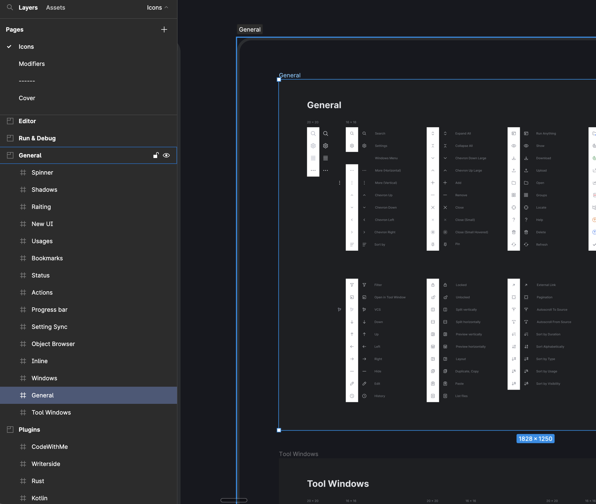
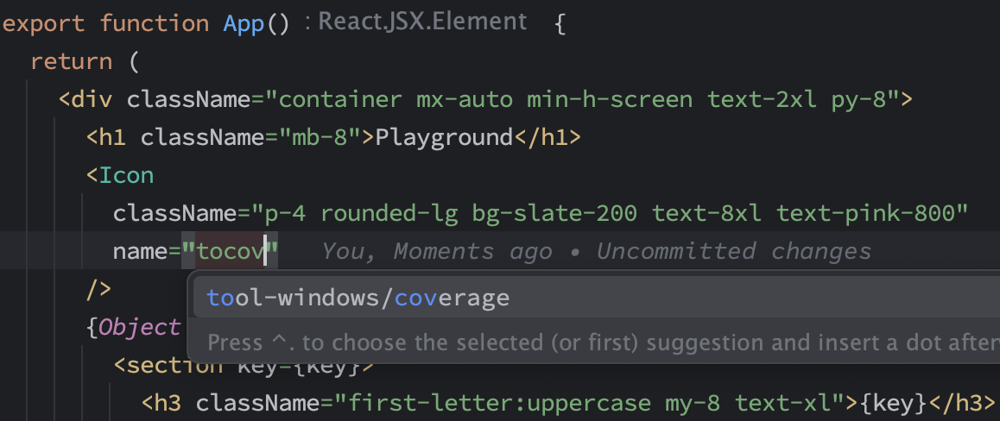
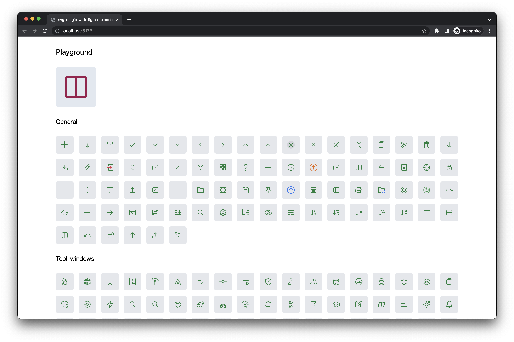

# SVG sprite generation on steroids with Figma export

This example based on the [JetBrains Int UI Icons (Community)](<https://www.figma.com/file/qjGIOVF6243bClGjQid2Y5/Int-UI-Icons-(Community)?type=design&node-id=5590-53429&t=Z8UNLvCnALbUxzRA-0>).

I will skip some common steps, if you're interested in details, please check [Simple Figma export example](../figma-simple-export).

Conditions and requirements (I wanted to export only a part of the icons):



- "Icons" page
- "General" section
- "General" and "Tool Windows" frames
- Visible Component Sets without "20x20" icons
- Only "Light" icons

So, here is the configuration:

```javascript
const { formatExportFileName } = require('@neodx/figma');
const { toCase } = require('@neodx/std');

/**
 * @type {import('@neodx/figma').Configuration}
 */
module.exports = {
  export: {
    fileId:
      'https://www.figma.com/file/qjGIOVF6243bClGjQid2Y5/Int-UI-Icons-(Community)?type=design&node-id=955-20814',
    output: 'assets/icons',
    getExportFileName({ format, node }, root) {
      const componentsSet = root.registry.byId[node.parentId];
      const frame = root.registry.byId[componentsSet.parentId];
      const frameName = toCase(frame.source.name, 'ca-se');
      const parentName = toCase(componentsSet.source.name.replace(/^[^/]*\//, '').trim(), 'ca-se');

      return formatExportFileName(`${frameName}/${parentName}.${format}`);
    },
    collect: {
      target: [
        {
          type: 'CANVAS',
          filter: 'Icons'
        },
        {
          type: 'SECTION',
          filter: 'General'
        },
        {
          type: 'FRAME',
          filter: ['General', 'Tool Windows']
        },
        {
          type: 'COMPONENT_SET',
          // Ignoring hidden components and 20x20 components
          filter: node => node.source.visible !== false && !node.source.name.includes('20x20')
        },
        {
          type: 'COMPONENT',
          // Ignoring "Dark" theme, I think it can be covered by colors in CSS
          filter: 'Light'
        }
      ]
    }
  }
};
```

In the result, we have 145 source SVG icons built into 2 tiny sprites with full TS integration:



---


