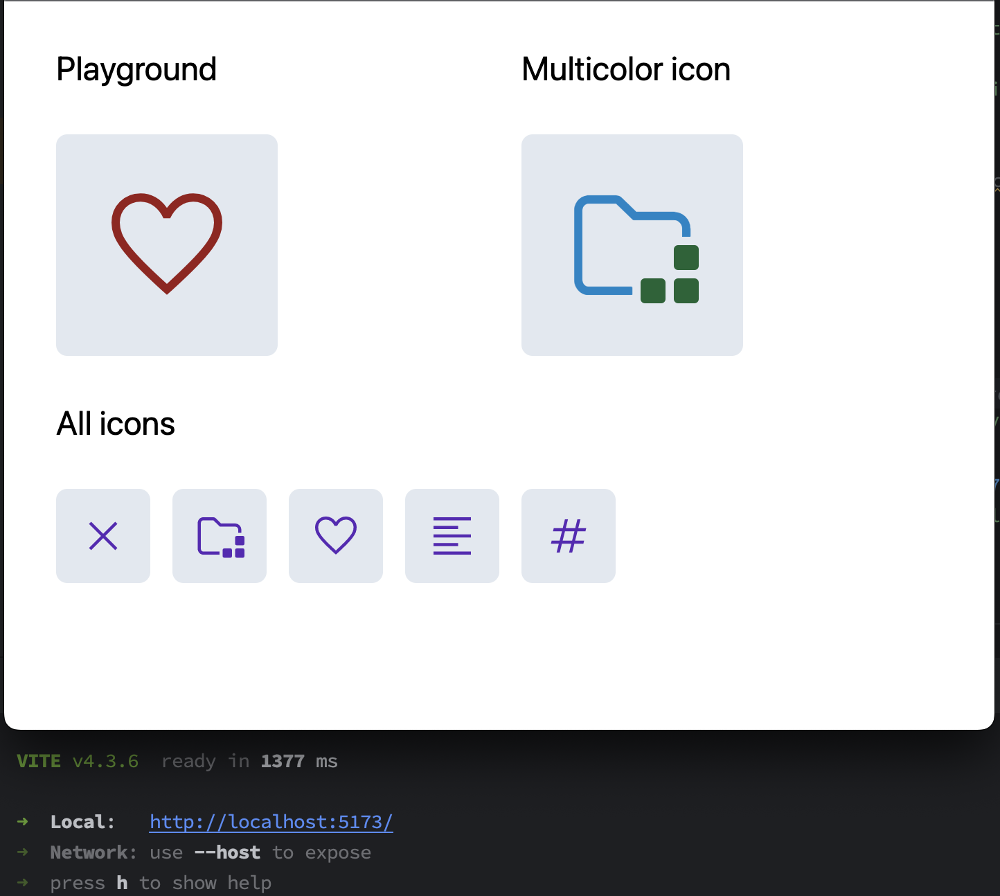

# Example of using `@neodx/svg` Vite plugin

This example shows how to use `@neodx/svg` as Vite plugin and simple step-by-step setup for React.

In addition, you can see how to use multicolored icons with TailwindCSS and CSS variable
(it's not very pleasant, but it works 🌝).



## Install

```bash
# npm
npm i -D @neodx/svg
# yarn
yarn add -D @neodx/svg
# pnpm
pnpm i -D @neodx/svg
```

## Add Vite plugin

```ts
// vite.config.ts
import svg from '@neodx/svg/vite';
import react from '@vitejs/plugin-react';
import { defineConfig } from 'vite';
import tsconfigPaths from 'vite-tsconfig-paths';

export default defineConfig(({ command }) => ({
  // ...
  plugins: [
    tsconfigPaths(),
    react(),
    svg({
      root: 'assets', // Root folder for SVG files, all source paths will be relative to this folder
      group: true, // Group SVG files by folder
      output: 'public', // Output folder for generated files
      metadata: {
        path: 'src/shared/ui/icon/sprite.gen.ts', // Output file for generated TypeScript definitions
        runtime: {
          // Generate additional runtime information
          size: true,
          viewBox: true
        }
      },
      resetColors: {
        replace: ['#000', '#eee', '#6C707E'], // Resets all known colors to `currentColor`
        replaceUnknown: 'var(--icon-color)' // Replaces unknown colors with custom CSS variable
      }
    })
  ]
}));
```

## Create an Icon component and describe basic styles

[shared/ui/icon/icon.tsx](./src/shared/ui/icon/icon.tsx):

```tsx
import clsx from 'clsx';
import type { SVGProps } from 'react';
import { SPRITES_META, type SpritesMap } from './sprite.gen';

// Merging all icons as `SPRITE_NAME/ICON_NAME`
export type SpriteKey = {
  [Key in keyof SpritesMap]: `${Key}/${SpritesMap[Key]}`;
}[keyof SpritesMap];

export interface IconProps extends Omit<SVGProps<SVGSVGElement>, 'name' | 'type'> {
  name: SpriteKey;
}

export function Icon({ name, className, viewBox, ...props }: IconProps) {
  const [spriteName, iconName] = name.split('/') as [
    keyof SpritesMap,
    SpritesMap[keyof SpritesMap]
  ];
  const { filePath, items } = SPRITES_META[spriteName];
  // @ts-expect-error mixed structures are confusing TS
  const { viewBox, width, height } = items[iconName];
  const rect = width === height ? 'xy' : width > height ? 'x' : 'y';

  return (
    <svg
      // We recommend to use specific component class for avoid collisions with other styles and simple override it
      className={clsx('icon', className)}
      /**
       * this prop is used by the "icon" class to set the icon's scaled size
       * @see https://github.com/secundant/neodx/issues/92 - Issue with original motivation
       */
      data-icon-aspect-ratio={rect}
      viewBox={viewBox}
      focusable="false"
      aria-hidden
      {...props}
    >
      <use href={`/${spriteName}.svg#${iconName}`} />
    </svg>
  );
}
```

[shared/ui/index.css](./src/shared/ui/index.css):

```css
@tailwind base;
@tailwind components;
@tailwind utilities;

@layer base {
  :root {
    /* By default, all icons will inherit color from parent, but we can override it */
    --icon-color: currentColor;
  }
}

@layer components {
  /* Our base class for all icons */
  .icon {
    @apply select-none fill-current inline-block text-inherit box-content;
  }

  .icon[data-icon-aspect-ratio='xy'] {
    @apply w-[1em] h-[1em];
  }

  .icon[data-icon-aspect-ratio='x'] {
    @apply w-[1em];
  }

  .icon[data-icon-aspect-ratio='y'] {
    @apply h-[1em];
  }
}
```

## Use it

```tsx
export function SomeComponent() {
  return (
    <h1 className="inline-flex items-center gap-2">
      Text with icon <Icon name="common/favourite" />
    </h1>
  );
}
```

### Roadmap for future

Under this example I want to cover all planned features of `@neodx/svg`, you can track it here:

- [x] Colors: auto replaces unknown colors
- [x] Colors: replace known to CSS variables
- [x] Colors: exclude specific icons
- [x] Colors: exclude specific colors
- [x] Non-standard sizes: generate `viewBox` and `width`/`height` attributes
- [x] Non-standard sizes: example of enhanced `Icon` component
- [ ] Inline SVG: auto-detection of internal references
- [ ] Inline SVG: injection into HTML
- [ ] Remove unnecessary attributes
- [ ] Remove unnecessary elements and prevent inlining
