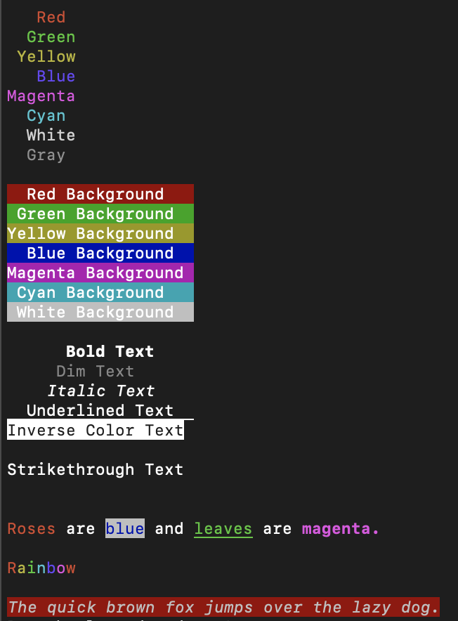

# @neodx/colors

Lightweight formatting and colorizing for the terminal.



## Installation

```bash
npm install @neodx/colors
# yarn
yarn add @neodx/colors
# pnpm
pnpm add @neodx/colors
```

## Usage

```ts
import { colors } from '@neodx/colors';

console.log(colors.red('Hello world!'));
```

## API

### colors

The `colors` object contains all the available colors.

```ts
import { colors } from '@neodx/colors';

colors.red; // red color
colors.green; // green color
colors.yellow; // yellow color
colors.blue; // blue color
colors.magenta; // magenta color
colors.cyan; // cyan color
colors.white; // white color
colors.gray; // gray color

colors.bgRed; // red background color
colors.bgGreen; // green background color
colors.bgYellow; // yellow background color
colors.bgBlue; // blue background color
colors.bgMagenta; // magenta background color
colors.bgCyan; // cyan background color
colors.bgWhite; // white background color

colors.bold; // bold text
colors.dim; // dim text
colors.italic; // italic text
colors.underline; // underline text
colors.inverse; // inverse text
colors.hidden; // hidden text
colors.strikethrough; // strikethrough text

colors.reset; // reset all styles
```
