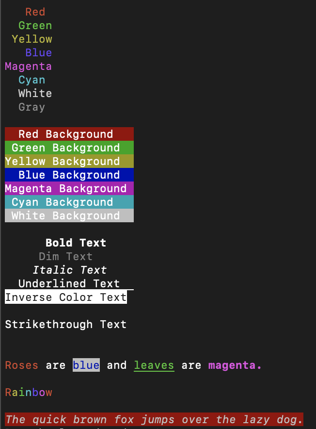

# @neodx/colors

Lightweight formatting and colorizing for the terminal.

`@neodx/colors` is publicly published (`access: public`) and used across the `@neodx`
namespace. The surface is small and intended to stay stable.



## Installation

```bash
npm install @neodx/colors
# yarn
yarn add @neodx/colors
# pnpm
pnpm add @neodx/colors
```

## Usage

```ts
import { colors } from '@neodx/colors';

console.log(colors.red('Hello world!'));
```

## API

### `colors`

Pre-built `Colors` instance from `createColors(true)`. Each key is a
`ColorFormatter` — `(message: string) => string`.

```ts
import { colors } from '@neodx/colors';

// colors

colors.black; // black color
colors.red; // red color
colors.green; // green color
colors.yellow; // yellow color
colors.blue; // blue color
colors.magenta; // magenta color
colors.cyan; // cyan color
colors.white; // white color
colors.gray; // gray color

// bright colors

colors.redBright; // bright red color
colors.greenBright; // bright green color
colors.yellowBright; // bright yellow color
colors.blueBright; // bright blue color
colors.magentaBright; // bright magenta color
colors.cyanBright; // bright cyan color
colors.whiteBright; // bright white color

// background colors

colors.bgBlack; // black background color
colors.bgRed; // red background color
colors.bgGreen; // green background color
colors.bgYellow; // yellow background color
colors.bgBlue; // blue background color
colors.bgMagenta; // magenta background color
colors.bgCyan; // cyan background color
colors.bgWhite; // white background color

// modifiers

colors.bold; // bold text
colors.dim; // dim text
colors.italic; // italic text
colors.overline; // overline text
colors.underline; // underline text
colors.inverse; // inverse text
colors.hidden; // hidden text
colors.strikethrough; // strikethrough text

colors.reset; // reset all styles
```

### `createColors`

Factory that builds a `Colors` map. When coloring is disabled, each formatter is
the identity function.

```ts
import { createColors } from '@neodx/colors';

const colors = createColors(isTTY?, disabled?, force?);
```

| Argument   | Default | Role                                           |
| ---------- | ------- | ---------------------------------------------- |
| `isTTY`    | `false` | Treat stdout as a TTY when deciding enablement |
| `disabled` | `false` | Force all formatters to identity               |
| `force`    | `false` | Force coloring on regardless of env / TTY      |

Enablement also respects `NO_COLOR`, `--no-color`, `FORCE_COLOR`, `--color`,
`GITHUB_ACTIONS`, `CI`, Windows, and `TERM=dumb`.

### Types

| Export           | Meaning                                   |
| ---------------- | ----------------------------------------- |
| `Colors`         | `Record<ColorName, ColorFormatter>`       |
| `ColorName`      | Keys of the built-in color / modifier map |
| `ColorFormatter` | `(message: string) => string`             |
