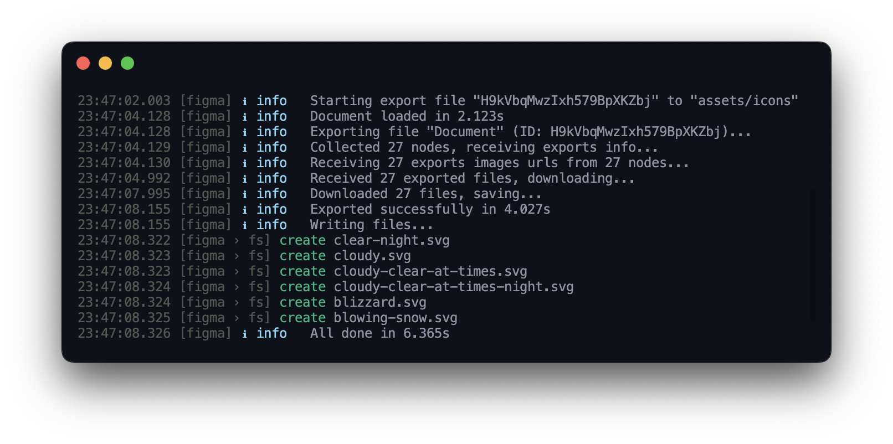

# @neodx/figma

The modern Figma integration tools, typed API, human-friendly files traversing, assets exporter, and more.

<a href="https://www.npmjs.com/package/@neodx/log">
  
</a>


> **Warning**
> This project is still in the development stage, under 0.x.x version breaking changes can be introduced in any release, but I'll try to make them loud.

- Flexible optimized Export API - the simple but powerful way to automate your design system
- Fully Typed Figma API and common helpers
- Brilliant human-friendly Figma documents [example below](#traverse-file-graph) (inspired by [figma-transformer](https://github.com/figma-tools/figma-transformer/))

## Installation

```bash
# yarn
yarn add -D @neodx/figma
# pnpm
pnpm install -D @neodx/figma
# npm
npm install -D @neodx/figma
```

## Getting started

We will start with the short example of the powerful export CLI:

1. Receive the Figma access token (see [Personal access token](#personal-access-token))
2. Create the `figma.config.js` file in the root of your project (see [Configuration](#configuration))
3. Run the CLI command `figma export` (see [CLI](#cli-figma-export))

### Personal access token

We are using the Figma API, so you need to provide a personal access token to access the API.

The token can be obtained from the [Figma account settings](https://www.figma.com/developers/api#access-tokens) (Figma > Help and Account > Account Settings > Personal Access Tokens).

You can provide the token via the `FIGMA_TOKEN` environment variable, the `--token` CLI argument, or the `token` option in the configuration file.

```bash
# via env variable
FIGMA_TOKEN=xxx figma export
# via CLI argument
figma export --token xxx
```

### Configure your project

The simple config is just a file ID, output path and rules for collecting components (what exactly you want to export).

We're using the [cosmiconfig](https://www.npmjs.com/package/cosmiconfig) package to load the configuration file, so you can use any supported format:
`figma.config.js`, `.figmarc.cjs`, etc. (we recommend to use the `.js` or `.cjs` format for possible future extensions).

Let's write it:

```javascript
// figma.config.js
const { formatExportFileName } = require('@neodx/figma');

/**
 * @type {import('@neodx/figma').Configuration}
 */
module.exports = {
  export: {
    fileId: 'YOUR_FILE_ID_OR_LINK',
    output: 'assets/icons',
    collect: {
      target: [
        {
          // First of all - select the "Icons" page
          type: 'CANVAS',
          filter: 'Icons'
        },
        {
          // Then select all components with names that starts with "32/"
          type: 'COMPONENT',
          filter: /32\/.*/
        }
      ]
    }
  }
};
```

We're highly recommend to check the [Configuration](#configuration) section to see all available options (There's a lot to see there!).

### CLI: ✨`figma export`

Export that you had configured in the previous step (don't forget to provide the token 🌝).



### Programmatically usage

Our CLI is just a wrapper around the library, when is not enough, you can use the library programmatically, all functions are exported from the main package!

```ts
import { createFigmaApi, parseFileIdFromLink, createFileGraph } from '@neodx/figma';

const figma = createFigmaApi({
  personalAccessToken: 'xxx'
  // or
  // accessToken: 'my-oauth-token'
});
// Load file by file key
const myFileId = parseFileIdFromLink('https://www.figma.com/file/xxx/yyy');
const myFile = await figma.getFile({
  id: myFileId
});
// Create well-typed human-friendly graph for convenient access to all file data
const graph = createFileGraph(myFileId, myFile);

const allTexts = graph.registry.types.TEXT.map(text => text.source.characters);
```

## Traverse file graph

The Figma API is designed as simple nested tree structure and not fit for high-level interactions.

For example, every change in the real document will lead to a change in the tree structure from the API, you can't navigate through the tree structure,
you can't get all nodes of the same type or complex filters, etc.

We're providing powerful graph structure for easy traversing and accessing any data in the document.

```ts
import { createFileGraph, createFigmaApi } from '@neodx/figma';

const api = createFigmaApi({
  /* ... */
});
const file = await api.getFile({ id: 'xxx' });

const graph = createFileGraph('xxx', file);
// ...
```

### Collect specific components within the components sets

```ts
import { collectNodes, extractNodeType } from '@neodx/figma';

// All components in "Icons" page withing "32/..." component set
const icons32 = collectNodes(graph, {
  CANVAS: 'Icons',
  COMPONENT_SET: node => node.name.startsWith('32/')
});
```

### Collect instances by multiple criteria

```ts
import { collectNodes, extractNodeType } from '@neodx/figma';

const complexCollected = collectNodes(graph, {
  CANVAS: ['Icons', 'Assets'], // Include 2 pages
  FRAME: /Colored|Outlined|Filled/, // Filter frames with names that contains "Colored", "Outlined" or "Filled"
  extract: 'INSTANCE' // Get all instances
});
```

### Get all text nodes

```ts
const allTextNodes = graph.registry.types.TEXT.map(text => text.source.characters);
```

### Get defined colors

```ts
import { colord } from 'colord';

const filledColors = Object.values(graph.registry.styles).filter(
  ({ styleType, styles, remote }) => styleType === 'FILL' && !remote // remote colors are an external styles
);

for (const { name, styles } of filledColors) {
  const solid = styles.find(isPaintSolid);

  if (!solid) continue;
  const { r, g, b } = solid.color;

  const key = name.toLowerCase().replaceAll(/[-\/\s]/g, '.');
  const color = colord({
    r: Math.round(r * 255),
    g: Math.round(g * 255),
    b: Math.round(b * 255)
  }).toHex();

  console.log(name, color);
}
```

## CLI API

### Configuration

The CLI API is configurable via the `figma.config.js` (or any supported by `cosmiconfig` form) file in the root of your project.

The config file is optional if you want to use the default values and provide all settings via CLI arguments.

All CLI arguments and config fields are optional, you can define only what you need.

```javascript
/**
 * @type {import('@neodx/figma').Configuration}
 */
module.exports = {
  token: 'xxx', // Personal access token, can be defined via FIGMA_TOKEN env variable or `--token` CLI argument
  /**
   * Export configuration for the `figma export` command.
   * Can be defined as array to support multiple export configurations for different files (export: [{ ... }, { ... }])
   */
  export: {
    fileId: 'https://www.figma.com/file/xxx/yyy', // Figma file id, can be ID or the full file link that will be parsed via `parseFileIdFromLink` function
    output: 'assets/icons', // Output directory, e.g. `--output ./assets`
    downloadConcurrency: 5, // Images download concurrency
    receiveExportsBatching: 100, // Batch size for the receiving images download urls (count of the node IDs in one request)
    receiveExportsResolver: 'svg', // See details below
    receiveExportsConcurrency: 3, // Image urls loading concurrency
    optimize: {}, // Override images optimization config or disable it
    /**
     * Exported nodes can provide wrong built-in names, so we can override them here.
     *
     * @param item - Downloaded item
     * @param root - Root node of the exported file
     *
     * @example ({ node, format }) => `${node.source.name}.${format}`
     * @default Lowercased node name separated by "/" + scale postfix if scale > 1
     */
    getExportFileName({ format, node }, root) {
      const parent = root.registry.byId[node.parentId];

      return formatExportFileName(`${parent.source.name.toLowerCase()}.${format}`);
    },
    // See details below
    collect: {
      /**
       * Filter conditions for collecting nodes hierarchy.
       * "type" is a node type, e.g. "CANVAS", "FRAME", "COMPONENT", etc.
       * "filter" can be defined as RegExp, string, function or array of them (arrays are joined with OR operator).
       *
       * This example works as:
       * 1. Take only "Icons" page
       * 2. Take frames with names that contains "Colored", "Outlined" or "Filled"
       * 3. Take components with "Light" and "Dark" names
       */
      target: [
        {
          type: 'CANVAS',
          filter: 'Icons' // Include only "Icons" page
        },
        {
          type: 'FRAME',
          filter: /Colored|Outlined|Filled/ // Include only frames with names that contains "Colored", "Outlined" or "Filled"
        },
        {
          type: 'COMPONENT',
          filter: ['Light', 'Dark'] // Include components with "Light" or "Dark" name
        }
      ],
      /**
       * When we're done with filtering nodes hierarchy, we can extract the nodes we want to export.
       * Can accept a specific node type, custom function or array of them.
       * @example (node) => node.registry.types.COMPONENT // export all components
       * @example 'COMPONENT' // export all components too
       * @example ['COMPONENT', 'FRAME'] // export all components and frames
       * @default Extracts all `COMPONENT` nodes.
       */
      extract: 'INSTANCE' // Extract only instances
    }
  }
};
```

- `export.collect` is an optional configuration for the [collectNodes API](#collectnodesroot-params).
- `export.receiveExportsResolver`, `export.receiveExportsBatching`, `export.receiveExportsConcurrency` - see [receiveExportsDownloadInfo](#receiveexportsdownloadinfo-api-fileid-target-logger-resolver-batching-concurrency-)
- `export.downloadConcurrency` - see [downloadExports](#downloadexports-items-fetch-logger-concurrency-)
- `export.optimize` - see [optimizeExport](#optimizeexportdownloaded-params)

### `figma export`

Export Figma file to the filesystem (file can be defined in the config)

- `--output, -o` - Output directory, e.g. `--output ./assets`
- `--verbose` - Verbose mode for debug
- `--dry-run` - Dry run mode, don't write any files, just show what will be done in the console
- `--token, -t` - Figma personal access token, can be defined in the config

## Node API

### `createFigmaApi(params)`

Creates a Figma API client. All types, params and results are also exported from the package.

```typescript
import { createFigmaApi } from '@neodx/figma';

const api = createFigmaApi({
  personalAccessToken: 'xxx'
});

const file = await api.getFile({
  id: 'xxx'
});

console.log(file);
```

You can find the API documentation [in the official Figma docs](https://www.figma.com/developers/api).

Parameters:

```ts
interface CreateFigmaApiParams {
  /**
   * The base URL of the Figma API (with version).
   * @default 'https://api.figma.com/v1'
   */
  baseUrl?: string;
  /**
   * You can provide your own fetch implementation.
   */
  fetch?: typeof fetch;
  logger?: LoggerMethods<'info' | 'error' | 'debug'>;
  /**
   * The personal access token of the Figma API.
   */
  personalAccessToken?: string;
  /**
   * The oAuth access token.
   */
  accessToken?: string;
}
```

Returns an object with the API methods:

- `getFile({ id, ...params }: GetFileParams)`: `GetFileResult` - GET /v1/files/:key
- `getFileNodes<Node extends AnyNode>({ id, ...params }: GetFileNodesParams)`: `GetFileNodesResult<Node>` - GET /v1/files/:key/nodes
- `getImage({ id, ...params }: GetImageParams)`: `GetImageResult` - GET/v1/images/:key
- `getImageFills({ id }: GetImageFillsParams)`: `GetImageFillsResult` - GET/v1/files/:key/images
- `getComments({ id }: GetCommentsParams)`: `GetCommentsResult` - GET/v1/files/:key/comments
- `postComments({ id, ...body }: PostCommentsParams)`: `PostCommentResult` - POST/v1/files/:file_key/comments
- `deleteComments({ id, comment_id }: DeleteCommentsParams)`: `void` - DELETE/v1/files/:file_key/comments/:comment_id
- `getMe()`: `GetUserMeResult` - GET/v1/me
- `getVersions({ id }: GetVersionsParams)`: `GetVersionsResult` - GET/v1/files/:key/versions
- `getTeamProjects({ team_id }: GetTeamProjectsParams)`: `GetTeamProjectsResult` - GET/v1/teams/:team_id/projects
- `getProjectFiles({ project_id }: GetProjectFilesParams)`: `GetProjectFilesResult` - GET/v1/projects/:project_id/files
- `getTeamComponents({ team_id }: GetTeamComponentsParams)`: `GetTeamComponentsResult` - GET/v1/teams/:team_id/components
- `getFileComponents({ id }: GetFileComponentsParams)`: `GetFileComponentsResult` - GET/v1/files/:file_key/components
- `getComponent({ key }: GetComponentParams)`: `GetComponentResult` - GET/v1/components/:key
- `getTeamComponentSets({ team_id }: GetTeamComponentSetsParams)`: `GetTeamComponentSetsResult` - GET/v1/teams/:team_id/component_sets
- `getFileComponentSets({ id }: GetFileComponentSetsParams)`: `GetFileComponentSetsResult` - GET/v1/files/:file_key/component_sets
- `getComponentSet({ key }: GetComponentSetParams)`: `GetComponentSetResult` - GET/v1/component_sets/:key
- `getTeamStyles({ team_id }: GetTeamStylesParams)`: `GetTeamStylesResult` - GET/v1/teams/:team_id/styles
- `getFileStyles({ id }: GetFileStylesParams)`: `GetFileStylesResult` - GET/v1/files/:file_key/styles
- `getStyle({ key }: GetStyleParams)`: `GetStyleResult` - GET/v1/styles/:key

### `createFileGraph(fileId, file): GraphNode<Document>`

Create a well-typed human-friendly graph for convenient access to the Figma document data.

- `fileId` - Your Figma file id, can be parsed from the file link via [`parseFileIdFromLink`](#parsefileidfromlinklink-string) function
- `file` - Figma file data from [`api.getFile`](https://www.figma.com/developers/api#get-file-endpoint)

```ts
const graph = createFileGraph(fileId, myFigmaFile);

// Every node contains a two subgraphs with equal structure but different meaning:
graph.children; // registry of direct child nodes
graph.registry; // registry of ALL nodes in the document (or any other node)
```

#### `GraphNode`

```ts
declare const node: GraphNode<TextNode>;

node.id; // node id
node.type; // node type (TEXT, FRAME, etc.)
node.source; // node source data, original node data from Figma API
node.children; // GraphNodeRegistry; node children registry
node.registry; // GraphNodeRegistry; aggregated registry of all nodes inside node
node.parentId; // parent node id (if exists)
node.styles; // ComputedStyleNode[]; computed styles for node
```

#### `GraphNodeRegistry`

```ts
declare const registry: GraphRegistry;

registry.types; // registry of nodes grouped by type
registry.types.TEXT; // array of all text nodes
registry.byId; // registry of nodes by id
registry.byId['xxx']; // node with id 'xxx'
registry.byId['xxx'].registry; // registry of nodes inside node with id 'xxx'
registry.list; // array of all nodes
registry.styles; // key-value object with computed styles (ComputedStyleNode) for all nodes
```

#### `ComputedStyleNode`

```ts
// "Style" is a original Figma API style object
interface ComputedStyleNode extends Style {
  /**
   * Style node id
   */
  id: NodeID;
  /**
   * An array of paint styles (fills, strokes, etc.)
   */
  styles: Paint[];
  textStyles?: TypeStyle;
}
```

### `collectNodes(root, params)`

Function for hierarchical filtering, collecting and extracting nodes from the Figma document.

```ts
collectNodes(myGraph, {
  extract: 'INSTANCE',
  target: [
    {
      type: 'CANVAS',
      filter: 'Icons'
    },
    {
      type: 'FRAME',
      filter: ['Tools', 'General']
    }
  ]
});
```

- `root`: `GraphNode<DocumentNode>` - root node for collecting
- `params.target`: `CollectTarget | CollectTarget[]` - ordered list of target nodes for collecting
- `params.extract`: `NodesExtractor | NodeType | Array<NodeType | NodesExtractor>` - nodes extractor, can be a node type ("INSTANCE"), custom function or array of them

In the result, you will get an array of nodes.

### Export API

#### `exportFile(params)`

Top-level function that aggregates all the export logic:

1. Collect exported nodes
2. Receive download urls for the collected nodes
3. Download images
4. Optimize and save images to the filesystem

```ts
interface ExportFileParams {
  api: FigmaApi;
  vfs: VFS;
  target: GraphNode<DocumentNode>;
  logger?: FigmaLogger;
  optimize?: false | OptimizeExportParams;
  collect?: CollectNodesParams;
  downloadConcurrency?: number;
  receiveExportsResolver?: ReceiveExportsDownloadInfoParams['resolver'];
  receiveExportsBatching?: number;
  receiveExportsConcurrency?: number;
  /**
   * Exported nodes can provide wrong built-in names, so we can override them here.
   *
   * @param item - Downloaded item
   * @param root - Root node of the exported file
   *
   * @example ({ node, format }) => `${node.source.name}.${format}`
   * @default Lowercased node name separated by "/" + scale postfix if scale > 1
   */
  getExportFileName?(item: DownloadedItem, root: GraphNode<DocumentNode>): string;
}
```

Parameters description:

- `api` - Figma API instance
- `vfs` - [@neodx/vfs](https://www.npmjs.com/package/@neodx/vfs) instance
- `target`: [GraphNode](#graphnode) - document node for export
- `logger` - [Logger](https://www.npmjs.com/package/@neodx/log)
- `collect` - see [collectNodes](#collectnodesroot-params)
- `receiveExportsResolver`, `receiveExportsBatching`, `receiveExportsConcurrency` - see [receiveExportsDownloadInfo](#receiveexportsdownloadinfo-api-fileid-target-logger-resolver-batching-concurrency-)
- `downloadConcurrency` - see [downloadExports](#downloadexports-items-fetch-logger-concurrency-)
- `optimize` - see [optimizeExport](#optimizeexportdownloaded-params)

#### `receiveExportsDownloadInfo({ api, fileId, target, logger?, resolver?, batching?, concurrency? })`

Collect all download links for the passed `target` nodes in `fileId` document.

Returns an array of [DownloadableItem](#downloadableitem) objects, which can be passed to the [downloadExports](#downloadexports-items-fetch-logger-concurrency-)

- `api` - Figma API instance
- `fileId` - Figma file id
- `target`: [GraphNode[]](#graphnode) - array of nodes for export
- `logger` - [Logger](https://www.npmjs.com/package/@neodx/log)
- `batching` - batching for downloading (how much IDs will be requested at the same time), default: `50`
- `concurrency` - concurrency for downloading, default: `3`
- `resolver` - [ExportResolver | ExportResolver[]](#ExportResolver). By default, the `svg` strategy is used.

##### `ExportResolver`

The exports strategy, can be one of the following:

- `"svg"/"png"/"pdf"/"jpg"` - Export nodes as images with the specified format
- `"exports"` - Download specified nodes as it is defined in the "Export" tab in the Figma UI
- Custom function - `(node: GraphNode) => ExportSetting[]`

  ```javascript
  const example = node => [
    {
      format: node.source.name.includes('picture') ? 'png' : 'svg',
      suffix: '',
      constraint: {
        type: ConstrainType.SCALE,
        value: 1
      }
    }
  ];
  ```

##### `DownloadableItem`

```ts
interface DownloadableItem {
  setting: ExportSetting;
  format: 'svg' | 'png' | 'jpg' | 'pdf';
  scale: number;
  node: GraphNode<AnyNode>;
  url: string;
}
```

#### `downloadExports({ items, fetch?, logger?, concurrency? })`

Simple abstraction for downloading Figma nodes exports.

- `items` - array of nodes for export from [receiveExportsDownloadInfo](#receiveexportsdownloadinfo-api-fileid-target-logger-resolver-batching-concurrency-)
- `fetch` - custom fetch function, default: `globalThis.fetch`
- `logger` - [Logger](https://www.npmjs.com/package/@neodx/log)
- `concurrency` - concurrency for downloading, default: `5`

#### `optimizeExport(downloaded, params?)`

Optimize downloaded exports if it's possible.

Returns an optimized content (string) or the original content if optimization is not possible.

- `downloaded`: `DownloadedNode` - target downloaded node from [downloadExports](#downloadexports-items-fetch-logger-concurrency-)
- `params`: `{ svgoConfig?: SVGO.Config }` - custom params

### Helpers

#### `parseFileIdFromLink(link: string)`

Parse file id from Figma file link.

```ts
import { parseFileIdFromLink, createFigmaApi } from '@neodx/figma';

const api = createFigmaApi({
  personalAccessToken: process.env.FIGMA_TOKEN
});

const fileId = parseFileIdFromLink('https://www.figma.com/file/xxx/yyy'); // 'xxx'
const file = await api.getFile({ id: fileId });
```

#### `getColor(color: Color)`

Wrapper around [colord](https://github.com/omgovich/colord) for getting high-level color manipulation API.

```ts
import { getColor } from '@neodx/figma';

const color = getColor(myTextNode.fills[0].color);

color.toHex(); // '#ffffff'
```

## Motivation

I've been looking for a stable maintaining Figma API with built-in high-level structures, abstractions and common features for implementing high-level tools for Figma.
But I didn't find anything that would suit me, [figma-js](https://github.com/jemgold/figma-js) and [figma-api](https://github.com/didoo/figma-api) both are not maintained, low-level API only and depends on the axios library, which is not suitable for me.

Next, I found [figma-transformer](https://github.com/figma-tools/figma-transformer), nice project for creating a human-friendly data structure, but it's not a full-featured, not maintained, and written in **very** unsafe and untyped style.

So I decided to create my own Figma API, which will be:

- **Powerful CLI** solves the most common tasks
- **Fully typed** consistent Figma API and common helpers
- **Convenient high-level** Node.JS API for working with Figma projects
- **Web API based** and not depends on specific third-party libraries
- **Safe** and **stable** as possible without strict value validation (via `zod`, `runtypes` or something like that)
- etc.

In other words, the holistic high-level well-featured instrument.

## Inspiration

This project got inspiration about API design and some features from the following projects:

- [figma-js](https://github.com/jemgold/figma-js)
- [figma-api](https://github.com/didoo/figma-api)
- [figma-api-exporter](https://github.com/slawomirkolodziej/figma-api-exporter)
- [figma-transformer](https://github.com/figma-tools/figma-transformer)

## License

[MIT](https://github.com/secundant/neodx/blob/main/LICENSE)
