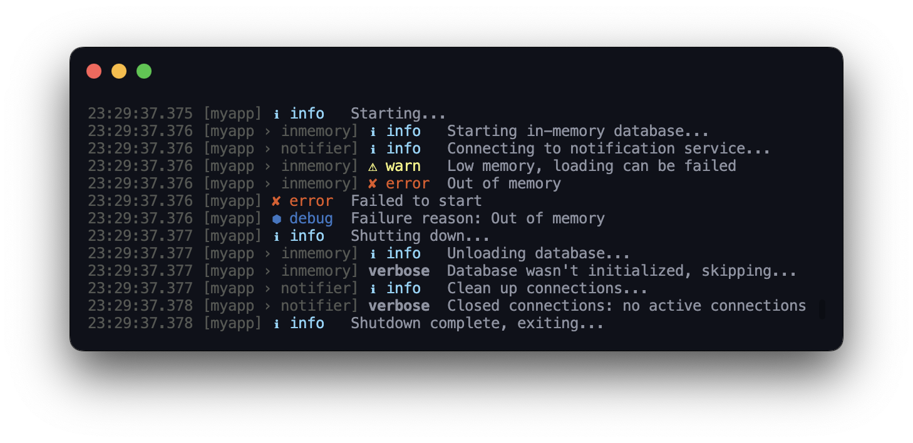

<h1 align="center">
  @neodx/log
</h1>

<h4 align="center">
  Lightweight flexible isomorphic logging framework
</h4>

<div align="center">
  
</div>

> **Warning**
> This project is still in the development stage, under 0.x.x version breaking changes can be introduced in any release, but I'll try to make them loud.

- **Tiny**. ~1kb!
- **Fast enough**. No extra overhead, no hidden magic
- **Customizable**. You can replace most of the parts with your own
- **Isomorphic**. Works in node.js and browser without any changes, pre-configured for both environments
- **Typed**. Written in TypeScript, with full type support

```typescript
const log = createLogger({
  name: 'my-app',
  level: 'info'
});

log.info('Hello, world!'); // [my-app] Hello, world!
log.info({ object: 'property' }, 'Template %s', 'string'); // Template string { object: 'property' }
log.debug('Hello, world!'); // nothing, because debug level is disabled

const child = log.child('example');

child.warn('Hello, world!'); // [my-app › example] Hello, world!
```

## Installation

```bash
# yarn
yarn add @neodx/log
# npm
npm install @neodx/log
# pnpm
pnpm install @neodx/log
```

## Usage

### First steps

For basic usage, you can just create a logger and start logging:

```typescript
import { createLogger } from '@neodx/log';

const log = createLogger();

log.info('Hello, world!'); // Hello, world!
```

### Adding a name

But by default, the logger doesn't have a name, so you can't distinguish between different loggers.
Let's add a name:

```typescript
const log = createLogger({
  name: 'my-app'
});

log.info('Hello, world!'); // [my-app] Hello, world!
```

### Log levels

We're supporting multiple log levels for semantic and output control.

You can use one of the built-in log levels: `error`, `warn`, `info`, `verbose`, `debug`:

```typescript
log.error('Something went wrong!'); // errors most important level
log.warn('Deprecated function used!'); // warnings
log.info('User logged in'); // information, most used level, neutral messages
log.verbose('User opened the page %s', '/home'); // verbose messages, extended information,
log.debug({ login, password }, 'User logged in, session id: %s', sessionId); // debug messages, the least important level, can contain sensitive information for debugging purposes
```

<div align="center">
  
</div>

### Formatting, metadata, and errors

Every log method supports [format template](#format-template) and optional error/metadata as the first argument.
"Metadata" is an object with your data, which will be serialized to JSON and added to the log message.

You can use any combination of arguments:

- Template/raw - `log.info('Hello, %s!', 'world')`, `log.info('Hello, world!')`
- Metadata - `log.info({ my: 'field' })`
- Error - `log.error(new Error('Something went wrong!'))`
- Error with metadata `log.error({ err: new Error('Something went wrong!'), foo: 'bar' })`

In other words:

- If the first argument is an object, it will be treated as metadata, other arguments are a format template and arguments for it
- If the first argument is an error, it will be treated as an error, other arguments are a format template and arguments for it
- Otherwise, the first argument is a format template and the other arguments are arguments for it

Let's see how it works:

```typescript
const log = createLogger();

log.info('Hello, world!'); // "Hello, world!"
log.info({ name: 'world' }); // [ Metadata: { "name": "world" } ]
log.info('Hello, %s!', 'world'); // "Hello, world!"
log.info({ name: 'world' }, 'Hello, %s!', 'world'); // [ Metadata: { "name": "world" } ] Hello, world!
log.error(new Error('Something went wrong!')); // Error: Something went wrong!
log.error({ err: new Error('Something went wrong!'), foo: 'bar' }); // Error: Something went wrong! [ Metadata: { "foo": "bar" } ]
```

## Key concepts

### Log levels

Levels are a semantic method and mechanism for controlling output in different environments.

```typescript
const log = createLogger({
  /**
   * @default "info"
   */
  level: process.env.NODE_ENV === 'production' ? 'info' : 'debug'
});

log.error('Always visible'); // "error" satisfies both "info" and "debug" restrictions
log.info('It is visible too'); // "info" satisfies both restrictions too
log.debug('But this is not'); // will not be visible in production, because "debug" doesn't satisfy "info" restriction
```

If you want to introduce your levels, you can do it with `levels` option:

```typescript
import { createLogger, LOGGER_SILENT_LEVEL } from '@neodx/log';

const log = createLogger({
  level: 'success',
  /**
   * @default { error: 10, warn: 20, info: 30, verbose: 40, debug: 50 }
   */
  levels: {
    fatal: 10,
    error: 20,
    warn: 30,
    info: 40,
    success: 50,
    debug: 60,
    [LOGGER_SILENT_LEVEL]: Infinity // special level, which will disable all output
  }
});

log.success('Done successfully!');
log.warn('Let me check it...');
log.fail('Oops, or not done');
```

For some additional information about levels, see [createLogger API](#createlogger) options.

### Log targets

Imagine that you have a server application, and you want to get the following behavior:

- In development, you want to see all logs in the console
- In production, you want to see only errors in the console and all non-debug logs in the file
- In tests, you want to see only errors in the console

To achieve this, you can use `target` option and specify different targets based on the environment:

```typescript
const log = createLogger({
  target: [
    // Enabling pretty output for errors in test mode
    {
      level: 'error',
      target: process.env.NODE_ENV === 'test' ? createPrettyTarget() : []
    },
    // Enabling JSON stdout streaming for errors in production mode
    {
      level: 'error',
      target: process.env.NODE_ENV === 'production' ? createJsonTarget() : []
    },
    // Enabling file streaming for "info", "warn" and "error" in production mode
    {
      level: 'info',
      target: process.env.NODE_ENV === 'production' ? createFileTarget('/dev/null') : [] // Just an example, we don't support file target natively yet :)
    },
    // Enabling pretty output for "debug" in development mode
    {
      level: 'debug',
      target: process.env.NODE_ENV === 'development' ? createPrettyTarget() : []
    }
  ]
});
```

It's an example for multiple targets configuration only, but you also can use a single target and multiple targets on same level, see [createLogger API](#createlogger) options for more information.

### Format template

We're providing support for **limited (_see further_)** [printf](https://en.wikipedia.org/wiki/Printf_format_string) format for log messages.
You can annotate string with special placeholders, which will be replaced with values from the arguments list:

- `%s` - string
- `%d` - number
- `%i` - integer
- `%f` - float
- `%j` - JSON, under the hood we're resolving circular references (they will be replaced with `"[Circular]"`)
- `%o`, `%O` - object, in our implementation, it's the same as `%j`
- `%%` - percent sign

To start using it, just add placeholders to your message:

```typescript
log.info('Raw string'); // "Raw string", no placeholders, no arguments
log.info('Hello, %s!', 'world'); // "Hello, world!"
log.info('Hello, %s, you are %d years old!', 'John', 30); // "Hello, John, you are 30 years old!"
log.info('Hello, %s, you are %i years old! Your salary is %f', 'John', 30, '1000.5'); // "Hello, John, you are 30 years old! Your salary is 1000.5"
log.info('Object: %j', { foo: 'bar' }); // "Object: { "foo": "bar" }"
const object = { foo: 'bar' };

object.bar = object; // Circular reference
log.info('Circular object: %j', object); // "Circular object: { "foo": "bar", "bar": "[Circular]" }"
```

In specific cases, you can replace our `printf` implementation with your own:

```typescript
import { createLoggerFactory, DEFAULT_LOGGER_PARAMS } from '@neodx/log';
import { readArguments } from '@neodx/log/utils';
import { format } from 'node:util';

export const createLogger = createLoggerFactory({
  formatMessage: (message: string, args: unknown[]) => format(message, ...args),
  readArguments,
  defaultParams: {
    ...DEFAULT_LOGGER_PARAMS
    // Your default params
  }
});
```

## Advanced

### Building your own logger

If you don't feel good with our built-in core parts, and you want to build your own logger, you can use `createLoggerFactory` function:

```typescript
import { createLoggerFactory } from '@neodx/log';
import { readArguments } from '@neodx/log/utils';

export const createLogger = createLoggerFactory({
  defaultParams: {
    ...DEFAULT_LOGGER_PARAMS,
    target: createConsoleTarget()
  },
  formatMessage: (message: string, args: unknown[]) => {
    // Your implementation
  },
  readArguments // Not too much sense to override it, but you can do it
});
```

## API

### `createLogger`

Create a new logger instance.

```typescript
import { createLogger, LOGGER_SILENT_LEVEL } from '@neodx/log';

const log = createLogger({
  /**
   * Logger name
   * @default No name
   */
  name: 'my-logger',
  /**
   * Logger level. All messages with lower level will be ignored.
   * @default info
   */
  level: 'debug',
  /**
   * Object with all available levels and their values.
   * @default { error: 10, warn: 20, info: 30, verbose: 40, debug: 50, [LOGGER_SILENT_LEVEL]: Infinity }
   */
  levels: {
    error: 10, // Lowest value - highest priority, can be disabled only with { level: "silent" }
    warn: 20,
    info: 30,
    debug: 40, // Highest value - lowest priority, logs will be emitted only with { level: "debug" },
    [LOGGER_SILENT_LEVEL]: Infinity // Special level, which can be used to disable all logs. Ignore it if you don't need it.
  },
  /**
   * Logger target(s). See details further.
   * @type {LoggerHandler<Level> | Array<LoggerHandler<Level> | LoggerHandleConfig<Level>>}
   */
  target: createConsoleTarget(),
  /**
   * Base metadata, which will be added to every log message
   * @default No metadata
   */
  meta: {
    foo: 'bar'
  },
  /**
   * Logger chunks transformer(s). See details further.
   * @type {LoggerTransformer<Level> | Array<LoggerTransformer<Level>>}
   */
  transform: params => ({
    ...params,
    meta: {
      ...params.meta,
      bar: 'baz'
    }
  })
});
```

Alternatively, can be created with [`createLoggerFactory`](#createLoggerFactory).

#### `target: LoggerHandler<Level>`

Single target for all logs.

```typescript
import { createLogger, createPrettyTarget, createJsonTarget } from '@neodx/log/node';

const log = createLogger({
  target: process.env.NODE_ENV === 'production' ? createJsonTarget() : createPrettyTarget()
});
```

#### `target: LoggerHandleConfig<Level>`

Log target can be described as a config object:

```typescript
const log = createLogger({
  target: {
    /**
     * The minimum level priority that this stream will receive.
     * @example 'info' - will receive 'info', 'warn' and 'error' chunks
     * @example 'warn' - will receive 'warn' and 'error' chunks
     * @example 'error' - will receive only 'error' chunks
     * @default no minimum level, will receive all chunks
     */
    level: 'info', // Will receive only 'info', 'warn' and 'error' chunks
    /**
     * Your handler function(s) that will receive log chunks.
     * @param chunk Log chunk
     */
    target: chunk => console.log(chunk)
  }
});
```

#### `target: Array<LoggerHandler<Level> | LoggerHandleConfig<Level>>`

If you need to send different log chunks to different targets, you can specify an array of targets:

```typescript
const log = createLogger({
  target: [
    {
      level: 'info', // Will receive only 'info', 'warn' and 'error' chunks
      target: [createJsonTarget(), chunk => writeLogToFile(chunk)]
    },
    {
      level: 'error', // Will receive only 'error' chunks
      target: chunk => sendLogToSentry(chunk)
    }
  ]
});
```

#### `transform: LoggerTransformer<Level>`

Single transformer for all logs.

```typescript
const log = createLogger({
  /**
   * Transform log chunks before sending them to the target(s)
   */
  transform: params => ({
    ...params,
    meta: redactSensitiveData(params.meta)
  })
});
```

#### `transform: Array<LoggerTransformer<Level>>`

> **Warning:**
> This feature probably will be removed.

If you need to transform different log chunks in different ways, you can specify an array of transformers:

```typescript
const log = createLogger({
  /**
   * Transform log chunks before sending them to the target(s)
   */
  transform: [
    params => ({
      ...params,
      meta: redactSensitiveData(params.meta)
    }),
    params => ({
      ...params,
      msg: replaceUnsecureLinks(params.msg)
    })
  ]
});
```

### `createLoggerFactory`

Customize logger behavior and create a new logger factory.

```typescript
import { createLoggerFactory, DEFAULT_LOGGER_PARAMS } from '@neodx/log';
import { readArguments, printf, type LogArguments } from '@neodx/log/utils';

const createLogger = createLoggerFactory({
  /**
   * Default logger parameters
   */
  defaultParams: {
    ...DEFAULT_LOGGER_PARAMS,
    target: createConsoleTarget()
  },
  /**
   * Message formatter
   * @default Our own limited implementation of printf
   */
  formatMessage: (message: string, args: unknown[]) => printf(message, args),
  /**
   * Arguments reader, used to extract metadata and error from the arguments list
   * @param args - Logger method's arguments
   * @returns A tuple with message fragments, metadata and optional error
   */
  readArguments: (args: unknown[]): LogArguments => readArguments(args) // I don't know why you want to replace it, but you can
});
```

## Motivation

Logging is one of the key aspects of software development, and you've probably heard advice like "Just log everything."
It's a solid recommendation, and chances are, you agree with it too.
However, in web development, logging can sometimes become challenging to manage and maintain, leading to a frustrating development experience (DX).

Often, we find ourselves avoiding logs until it becomes inevitable, removing them, or wrapping them in numerous conditions.
In today's development landscape, logs can be perceived as a hindrance to DX.
Nevertheless, embracing comprehensive logging is essential for effective software development and is required for building stable products.

So, what's the problem? Why do we avoid logging?

During software development, developers frequently face the same issue: "How can I turn off, replace, or modify my logs?"
The inability to easily control logging behavior often leads us to one of two choices - either drop the logs (we even have ESLint rules for this purpose) altogether or introduce an abstraction layer.

Dropping logs means avoiding any use of `console.log` and similar APIs, simply because we **cannot control them**.

On the other hand, abstractions come with their own set of trade-offs and there is no widely-accepted, easy-to-use solution available.

In my opinion, - we just don't have a good enough abstraction layer for logging:

- Small size
- Isomorphic
- Configurable
- Multiple transports support
- Multiple log levels support
- Built-in pretty-printing, JSON logging
- etc.

Okay, maybe we have some good enough solutions, but they are not perfect:

- [pino](https://www.npmjs.com/package/pino) - **really fast**, but 3kb (browser) size, huge API, no built-in pretty-printing
- [signale](https://www.npmjs.com/package/signale) - Not maintained, only Node.JS, only pretty-printing, no JSON logging
- [loglevel](https://www.npmjs.com/package/loglevel) - Not maintained, just a console wrapper
- Other solutions are not worth mentioning, they are too far from the "just take it and use it" state

And after all, I decided to create my own solution.

## Comparison

### JSON logging

This is a simple comparison of JSON logging output from different libraries.

<div align="center">
  
</div>

## Inspiration

This project got inspiration about API design and some features from the following projects:

- [pino](https://www.npmjs.com/package/pino)
- [signale](https://www.npmjs.com/package/signale)
- [loglevel](https://www.npmjs.com/package/loglevel)
- [winston](https://www.npmjs.com/package/winston)
- [bunyan](https://www.npmjs.com/package/bunyan)

## License

[MIT](https://github.com/secundant/neodx/blob/main/LICENSE)
